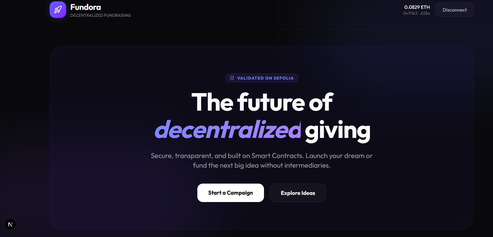
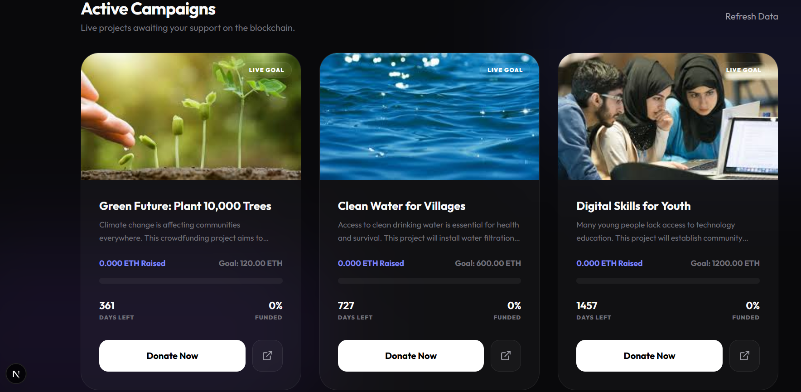

# 🚀 Fundora: Decentralized Crowdfunding Platform

Fundora is a modern, transparent, and secure crowdfunding platform built on the Ethereum blockchain. It allows users to create campaigns, set funding goals, and receive donations directly without any intermediaries.




<p align="center">


</p>



---

## 🛠 Tech Stack

- **Smart Contracts**: Solidity (0.8.28)
- **Development Framework**: Hardhat 3 (Beta)
- **Deployment**: Hardhat Ignition
- **Frontend**: Next.js 15 (App Router)
- **Styling**: Tailwind CSS 4
- **Blockchain Interface**: Wagmi & Viem
- **Icons**: Lucide React

---

## 🚀 Getting Started

### 1. Prerequisites
- **Node.js**: v22.x (LTS recommended)
- **Wallet**: MetaMask installed in your browser.
- **Provider**: An [Alchemy](https://www.alchemy.com/) or Infura API key for Sepolia.

### 2. Installation
Clone the repository and install dependencies:
```bash
# Install root dependencies
npm install

# Install frontend dependencies
cd frontend
npm install
cd ..
```

### 3. Environment Setup
Create a `.env` file in the root directory:
```env
PRIVATE_KEY=your_encrypted_private_key_here
SEPOLIA_RPC_URL=https://eth-sepolia.g.alchemy.com/v2/your_api_key
ENCRYPTION_PASSWORD=your_password_here
```

### 4. Deployment
To deploy the contract and automatically update the frontend constants:
```bash
# For Sepolia Testnet
HARDHAT_NETWORK=sepolia npm run deploy

# For Local Development (Requires 'npx hardhat node' running)
npm run deploy
```

---

## 💻 Running the Frontend
```bash
cd client
npm run dev
```
Visit [http://localhost:3000](http://localhost:3000) to see the app.

---

## 📁 Project Structure

- `/contracts`: Solidity smart contract (`CrowdFunding.sol`).
- `/scripts`: Custom deployment logic (`deploy.js`) including secure key decryption.
- `/ignition`: Deployment modules and state tracking.
- `/client`: Next.js frontend application.
  - `/app`: Next.js App Router (Layouts and Pages).
  - `/components`: Reusable React components.
  - `/config`: Wagmi and Web3 configuration.
  - `/constants`: Auto-generated contract ABI and Address.

---

## 🔒 Security
The project uses **OpenSSL AES-256-CBC** to encrypt the deployment private key. The `scripts/deploy.js` script handles the secure decryption at runtime using a user-provided password.